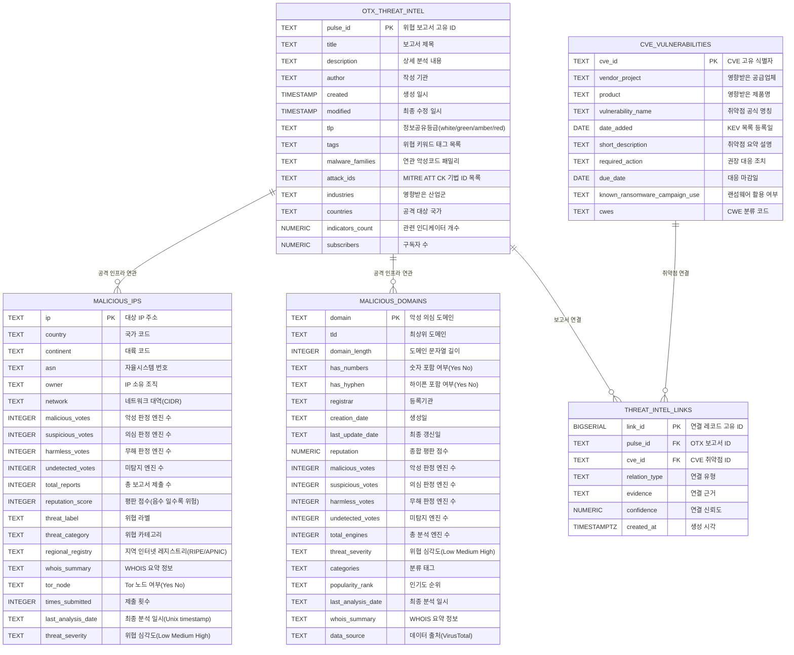

# 프로젝트 제안서: 자연어 기반 위협 인텔리전스 분석 에이전트 (ThreatIntel-Agent)

## 1. 도메인 및 활용 사례

### 선택한 도메인
본 프로젝트는 **사이버 위협 인텔리전스(Cyber Threat Intelligence)** 도메인을 대상으로 하며, AlienVault OTX(Open Threat Exchange) 보고서, CISA KEV(Known Exploited Vulnerabilities) 취약점 정보, VirusTotal 기반 악성 도메인 및 IP 평판 데이터를 통합하여 자연어 질의로 이상행위 및 위협 요소를 추출합니다.

### 대상 사용자와 분석 목적
- **대상 사용자**: SOC(보안운영센터) 분석가, 취약점 관리 담당자, 보안 컨설턴트
- **분석 목적**: 자연어 질문만으로 다중 위협 데이터베이스를 실시간 탐색하여, 취약점-악성코드-공격 인프라 간의 연관성을 자동으로 도출하고 우선순위 기반의 대응 의견을 제시하는 것

---

## 2. 데이터베이스 스키마

### 2.1 ERD (Mermaid)



### 2.2 테이블 정의 및 COMMENT

```sql
-- 1) OTX 위협 인텔리전스 보고서
CREATE TABLE IF NOT EXISTS otx_threat_intel (
    pulse_id            TEXT PRIMARY KEY,
    title               TEXT,
    description         TEXT,
    author              TEXT,
    created             TIMESTAMP,
    modified            TIMESTAMP,
    tlp                 TEXT CHECK (tlp IS NULL OR tlp IN ('white', 'green', 'amber', 'red')),
    tags                TEXT,
    malware_families    TEXT,
    attack_ids          TEXT,
    industries          TEXT,
    countries           TEXT,
    indicators_count    NUMERIC,
    subscribers         NUMERIC
);

COMMENT ON TABLE otx_threat_intel IS 'AlienVault OTX 기반 위협 인텔리전스 보고서';
COMMENT ON COLUMN otx_threat_intel.pulse_id          IS 'AlienVault OTX에서 발급한 위협 보고서 고유 ID';
COMMENT ON COLUMN otx_threat_intel.title             IS '위협 분석 보고서의 제목(공격 캠페인명 또는 주요 행위 요약)';
COMMENT ON COLUMN otx_threat_intel.description       IS '위협에 대한 상세 설명으로 공격 기법, 영향 범위, 초기 접근 경로 등이 포함됨';
COMMENT ON COLUMN otx_threat_intel.author            IS '보고서를 작성한 기관 또는 조직명(예: AlienVault, 커뮤니티 기여자)';
COMMENT ON COLUMN otx_threat_intel.created           IS '해당 위협 보고서가 OTX에 최초 게시된 일시';
COMMENT ON COLUMN otx_threat_intel.modified          IS '보고서 내용이 마지막으로 수정된 일시';
COMMENT ON COLUMN otx_threat_intel.tlp               IS 'Traffic Light Protocol 등급으로 정보 공유 범위를 결정(white=무제한, red=엄격)';
COMMENT ON COLUMN otx_threat_intel.tags              IS '쉼표로 구분된 위협 키워드 태그(예: phishing, powershell, ransomware)';
COMMENT ON COLUMN otx_threat_intel.malware_families  IS '해당 위협과 연관된 악성코드 패밀리 목록(예: Lumma Stealer, Kyber Ransomware)';
COMMENT ON COLUMN otx_threat_intel.attack_ids        IS 'MITRE ATT&CK 프레임워크 기법 ID 목록(예: T1566, T1059.001)';
COMMENT ON COLUMN otx_threat_intel.industries        IS '위협으로부터 영향을 받은 주요 산업군';
COMMENT ON COLUMN otx_threat_intel.countries         IS '공격 대상이 되거나 공격이 발원한 국가 목록';
COMMENT ON COLUMN otx_threat_intel.indicators_count  IS '해당 보고서에 포함된 IOC(Indicator of Compromise) 총 개수';
COMMENT ON COLUMN otx_threat_intel.subscribers       IS '해당 위협을 추적하는 OTX 사용자 수';

-- 2) CVE 취약점 (CISA KEV)
CREATE TABLE IF NOT EXISTS cve_vulnerabilities (
    cve_id                          TEXT PRIMARY KEY,
    vendor_project                  TEXT,
    product                         TEXT,
    vulnerability_name              TEXT,
    date_added                      DATE,
    short_description               TEXT,
    required_action                 TEXT,
    due_date                        DATE,
    known_ransomware_campaign_use   TEXT CHECK (known_ransomware_campaign_use IS NULL OR known_ransomware_campaign_use IN ('Known', 'Unknown')),
    cwes                            TEXT
);

COMMENT ON TABLE cve_vulnerabilities IS 'CISA KEV 기반 취약점 및 대응 마감 정보';
COMMENT ON COLUMN cve_vulnerabilities.cve_id                         IS '국제적으로 통용되는 취약점 고유 식별자(Common Vulnerabilities and Exposures)';
COMMENT ON COLUMN cve_vulnerabilities.vendor_project                 IS '취약점이 존재하는 소프트웨어를 개발한 공급업체명';
COMMENT ON COLUMN cve_vulnerabilities.product                        IS '취약한 제품 또는 서비스의 정확한 명칭';
COMMENT ON COLUMN cve_vulnerabilities.vulnerability_name             IS 'CISA가 공식 부여한 취약점 명칭';
COMMENT ON COLUMN cve_vulnerabilities.date_added                     IS '해당 취약점이 CISA KEV(Known Exploited Vulnerabilities) 카탈로그에 등록된 날짜';
COMMENT ON COLUMN cve_vulnerabilities.short_description              IS '취약점의 원인, 영향, 공격 시나리오에 대한 요약';
COMMENT ON COLUMN cve_vulnerabilities.required_action                IS '조직이 수행해야 할 우선 대응 조치(패치 적용, 설정 변경, 서비스 중단 등)';
COMMENT ON COLUMN cve_vulnerabilities.due_date                       IS 'CISA에서 정한 해당 취약점 대응 마감일로 미준수 시 규정 위반 가능성 있음';
COMMENT ON COLUMN cve_vulnerabilities.known_ransomware_campaign_use  IS '랜섬웨어 캠페인에서 실제로 활용된 적이 있는지 여부(Known/Unknown)';
COMMENT ON COLUMN cve_vulnerabilities.cwes                           IS '해당 취약점이 속하는 CWE(COMMON WEAKNESS ENUMERATION) 분류 코드';

-- 3) OTX-CVE 연결 테이블 (FK 관계 명시)
CREATE TABLE IF NOT EXISTS threat_intel_links (
    link_id       BIGSERIAL PRIMARY KEY,
    pulse_id      TEXT NOT NULL REFERENCES otx_threat_intel(pulse_id) ON DELETE CASCADE,
    cve_id        TEXT NOT NULL REFERENCES cve_vulnerabilities(cve_id) ON DELETE CASCADE,
    relation_type TEXT NOT NULL CHECK (relation_type IN ('keyword_match', 'attack_context', 'ransomware_context')),
    evidence      TEXT,
    confidence    NUMERIC CHECK (confidence IS NULL OR (confidence >= 0 AND confidence <= 1)),
    created_at    TIMESTAMPTZ NOT NULL DEFAULT NOW(),
    UNIQUE (pulse_id, cve_id, relation_type)
);

COMMENT ON TABLE threat_intel_links IS 'OTX 보고서와 CVE 취약점 사이의 키워드 기반 연결 테이블';
COMMENT ON COLUMN threat_intel_links.link_id       IS '연결 레코드 고유 ID';
COMMENT ON COLUMN threat_intel_links.pulse_id      IS '연결된 OTX 위협 보고서 ID';
COMMENT ON COLUMN threat_intel_links.cve_id        IS '연결된 CVE 취약점 ID';
COMMENT ON COLUMN threat_intel_links.relation_type IS '연결 유형(keyword_match, attack_context, ransomware_context)';
COMMENT ON COLUMN threat_intel_links.evidence      IS '연결 근거가 된 키워드 또는 설명';
COMMENT ON COLUMN threat_intel_links.confidence    IS '0~1 범위의 휴리스틱 연결 신뢰도';
COMMENT ON COLUMN threat_intel_links.created_at    IS '연결 레코드 생성 시각';

-- 4) 악성 의심 도메인
CREATE TABLE IF NOT EXISTS malicious_domains (
    domain              TEXT PRIMARY KEY,
    tld                 TEXT,
    domain_length       INTEGER,
    has_numbers         TEXT CHECK (has_numbers IS NULL OR has_numbers IN ('Yes', 'No')),
    has_hyphen          TEXT CHECK (has_hyphen IS NULL OR has_hyphen IN ('Yes', 'No')),
    registrar           TEXT,
    creation_date       TEXT,
    last_update_date    TEXT,
    reputation          NUMERIC,
    malicious_votes     INTEGER,
    suspicious_votes    INTEGER,
    harmless_votes      INTEGER,
    undetected_votes    INTEGER,
    total_engines       INTEGER,
    threat_severity     TEXT CHECK (threat_severity IS NULL OR threat_severity IN ('Low', 'Medium', 'High')),
    categories          TEXT,
    popularity_rank     TEXT,
    last_analysis_date  TEXT,
    whois_summary       TEXT,
    data_source         TEXT
);

COMMENT ON TABLE malicious_domains IS 'VirusTotal 기반 악성 의심 도메인 평판 정보';
COMMENT ON COLUMN malicious_domains.domain             IS '분석 대상 도메인 전체 주소(FQDN)';
COMMENT ON COLUMN malicious_domains.tld                IS '최상위 도메인(Top-Level Domain, 예: com, ch, ru)';
COMMENT ON COLUMN malicious_domains.domain_length      IS '도메인 문자열의 전체 길이로 DGA(Domain Generation Algorithm) 탐지에 사용 가능';
COMMENT ON COLUMN malicious_domains.has_numbers        IS '도메인에 숫자가 포함되었는지 여부(YES/NO)로 의심 피처로 활용';
COMMENT ON COLUMN malicious_domains.has_hyphen         IS '도메인에 하이픈이 포함되었는지 여부(YES/NO)';
COMMENT ON COLUMN malicious_domains.registrar          IS '도메인 등록 대행 기관명';
COMMENT ON COLUMN malicious_domains.creation_date      IS '도메인 최초 등록일(UNKNOWN인 경우도 있음)';
COMMENT ON COLUMN malicious_domains.last_update_date   IS '도메인 등록 정보 마지막 변경일';
COMMENT ON COLUMN malicious_domains.reputation         IS 'Virustotal 등이 산출한 종합 평판 점수로 낮을수록 일반적으로 안전';
COMMENT ON COLUMN malicious_domains.malicious_votes    IS '악성으로 판단한 보안 엔진의 수';
COMMENT ON COLUMN malicious_domains.suspicious_votes   IS '의심으로 판단한 보안 엔진의 수';
COMMENT ON COLUMN malicious_domains.harmless_votes     IS '무해로 판단한 보안 엔진의 수';
COMMENT ON COLUMN malicious_domains.undetected_votes   IS '탐지하지 못한 보안 엔진의 수';
COMMENT ON COLUMN malicious_domains.total_engines      IS '분석에 참여한 보안 엔진의 총 수';
COMMENT ON COLUMN malicious_domains.threat_severity    IS '종합 평판을 바탕으로 산출한 위협 심각도(LOW/MEDIUM/HIGH)';
COMMENT ON COLUMN malicious_domains.categories         IS '도메인에 부여된 분류 태그(JSON 또는 텍스트 형태)';
COMMENT ON COLUMN malicious_domains.popularity_rank    IS '해당 도메인의 월간 방문 인기도 순위(UNKNOWN일 수 있음)';
COMMENT ON COLUMN malicious_domains.last_analysis_date IS 'Virustotal 등에서 마지막으로 전체 엔진 분석을 수행한 일시(UNIX 타임스탬프 또는 UNKNOWN)';
COMMENT ON COLUMN malicious_domains.whois_summary      IS '도메인 등록 정보의 요약 본문(DNSSEC, 등록자, 네임서버 등)';
COMMENT ON COLUMN malicious_domains.data_source        IS '해당 평판 데이터의 수집 출처(예: VirusTotal)';

-- 5) 악성 의심 IP
CREATE TABLE IF NOT EXISTS malicious_ips (
    ip                  TEXT PRIMARY KEY,
    country             TEXT,
    continent           TEXT,
    asn                 TEXT,
    owner               TEXT,
    network             TEXT,
    malicious_votes     INTEGER,
    suspicious_votes    INTEGER,
    harmless_votes      INTEGER,
    undetected_votes    INTEGER,
    total_reports       INTEGER,
    reputation_score    INTEGER,
    threat_label        TEXT,
    threat_category     TEXT,
    regional_registry   TEXT,
    whois_summary       TEXT,
    tor_node            TEXT CHECK (tor_node IS NULL OR tor_node IN ('Yes', 'No')),
    times_submitted     INTEGER,
    last_analysis_date  TEXT,
    threat_severity     TEXT CHECK (threat_severity IS NULL OR threat_severity IN ('Low', 'Medium', 'High'))
);

COMMENT ON TABLE malicious_ips IS 'VirusTotal 기반 악성 의심 IP 평판 및 네트워크 정보';
COMMENT ON COLUMN malicious_ips.ip                 IS '분석 대상 IPv4 또는 IPv6 주소';
COMMENT ON COLUMN malicious_ips.country            IS 'IP가 할당된 국가의 ISO 두 자리 코드(예: CH, NL, US)';
COMMENT ON COLUMN malicious_ips.continent          IS 'IP가 속한 대륙 코드(예: EU, NA, AS)';
COMMENT ON COLUMN malicious_ips.asn                IS '해당 IP가 속한 자율시스템 번호(Autonomous System Number) 또는 UNKNOWN';
COMMENT ON COLUMN malicious_ips.owner              IS '해당 IP 대역을 소유·관리하는 ISP 또는 기관명';
COMMENT ON COLUMN malicious_ips.network            IS 'IP가 속한 네트워크 대역(CIDR 표기법, 예: 176.10.96.0/19)';
COMMENT ON COLUMN malicious_ips.malicious_votes    IS '악성으로 판단한 보안 엔진의 수';
COMMENT ON COLUMN malicious_ips.suspicious_votes   IS '의심으로 판단한 보안 엔진의 수';
COMMENT ON COLUMN malicious_ips.harmless_votes     IS '무해로 판단한 보안 엔진의 수';
COMMENT ON COLUMN malicious_ips.undetected_votes   IS '탐지하지 못한 보안 엔진의 수';
COMMENT ON COLUMN malicious_ips.total_reports      IS '해당 IP에 대한 총 보고서 제출 수';
COMMENT ON COLUMN malicious_ips.reputation_score   IS 'Virustotal 등이 산출한 평판 점수로 음수일수록 위협 가능성이 높음';
COMMENT ON COLUMN malicious_ips.threat_label       IS '엔진이 부여한 구체적 위협 라벨(예: clean, unrated, malware)';
COMMENT ON COLUMN malicious_ips.threat_category    IS '위협의 대분류(예: clean, malicious, suspicious)';
COMMENT ON COLUMN malicious_ips.regional_registry  IS '할당 기관의 지역 레지스트리(RIPE NCC, APNIC, ARIN 등)';
COMMENT ON COLUMN malicious_ips.whois_summary      IS 'IP 주소에 대한 WHOIS 조회 결과 요약문(INETNUM, NETNAME, COUNTRY 등)';
COMMENT ON COLUMN malicious_ips.tor_node           IS '해당 IP가 Tor 익명 네트워크의 출구/중계 노드인지 여부(YES/NO)';
COMMENT ON COLUMN malicious_ips.times_submitted    IS '해당 IP가 위협 커뮤니티에 제출된 총 횟수';
COMMENT ON COLUMN malicious_ips.last_analysis_date IS '마지막 전체 엔진 분석 일시(UNIX 타임스탬프)';
COMMENT ON COLUMN malicious_ips.threat_severity    IS '종합 평가에 따른 위협 심각도 단계(LOW/MEDIUM/HIGH)';
```

> **FK 설계 보완**: 원천 CSV의 OTX 보고서, CVE, 도메인, IP는 서로 다른 공개 인텔리전스 소스에서 수집되어 직접적인 ID 기반 FK가 부족합니다. 따라서 루브릭의 PK/FK 요건과 실제 분석 활용성을 함께 만족시키기 위해 `threat_intel_links` 연결 테이블을 추가하고, OTX 보고서(`pulse_id`)와 CVE(`cve_id`) 사이의 키워드 기반 연관 관계를 FK로 명시했습니다. 도메인/IP 테이블은 IOC 평판 속성 테이블로 유지하고, OTX와의 연관성은 자연어 질의 및 키워드/ATT&CK 기반 분석에서 활용합니다.

---

## 3. 샘플 질문 (정확히 10개)

### Easy (3개)

#### [Easy] Q1: "심각도가 'High'인 악성 IP가 몇 개인가요?"
```sql
SELECT COUNT(*) AS high_risk_ip_count
FROM malicious_ips
WHERE threat_severity = 'High';
```
**기대 결과**: 1행, `high_risk_ip_count = 12` (실제 Neon 적재 데이터 기준)

---

#### [Easy] Q2: "2026년 4월 28일에 CISA KEV에 추가된 취약점 목록을 보여주세요."
```sql
SELECT cve_id, vendor_project, product, vulnerability_name
FROM cve_vulnerabilities
WHERE date_added = '2026-04-28';
```
**기대 결과**: 2행 (실제 Neon 적재 데이터 기준: CVE-2024-1708, CVE-2026-32202)

---

#### [Easy] Q3: "데이터 소스가 'VirusTotal'인 도메인 중 평판 점수가 가장 낮은 TOP 5를 알려주세요."
```sql
SELECT domain, reputation, threat_severity, malicious_votes
FROM malicious_domains
WHERE data_source = 'VirusTotal'
ORDER BY reputation ASC
LIMIT 5;
```
**기대 결과**: 5행, reputation 오름차순 (실제 Neon 적재 데이터 기준)

---

### Medium (4개)

#### [Medium] Q4: "국가별로 악성으로 판정받은 IP 개수를 집계해주세요. (악성 판정 1개 이상)"
```sql
SELECT country,
       COUNT(*) AS malicious_ip_count,
       ROUND(AVG(reputation_score), 2) AS avg_reputation
FROM malicious_ips
WHERE malicious_votes > 0
GROUP BY country
ORDER BY malicious_ip_count DESC;
```
**기대 결과**: 17행, 국가코드·IP 개수·평균 평판 점수 컬럼 (실제 Neon 적재 데이터 기준)

---

#### [Medium] Q5: "'phishing' 키워드를 포함한 OTX 보고서와 연관된 CVE가 있나요?"
```sql
WITH phishing_pulses AS (
    SELECT pulse_id, title, tags, attack_ids
    FROM otx_threat_intel
    WHERE LOWER(tags) LIKE '%phishing%'
)
SELECT DISTINCT c.cve_id, c.vendor_project, c.product, p.title
FROM cve_vulnerabilities c
JOIN phishing_pulses p
    ON LOWER(c.short_description) LIKE '%phish%'
ORDER BY c.cve_id;
```
**기대 결과**: 0행 (현재 적재 데이터 기준 직접 phishing-CVE 키워드 매칭 없음. SQL은 정상 실행되며 무결성 검증용 질문으로 사용)

---

#### [Medium] Q6: "랜섬웨어로 알려진 취약점 중 대응 마감일이 가장 임박한 5개를 보여주세요."
```sql
SELECT cve_id, vendor_project, product, due_date, short_description
FROM cve_vulnerabilities
WHERE known_ransomware_campaign_use = 'Known'
   OR LOWER(short_description) LIKE '%ransomware%'
ORDER BY due_date ASC
LIMIT 5;
```
**기대 결과**: 5행, 마감일 기준 정렬된 CVE (실제 Neon 적재 데이터 기준)

---

#### [Medium] Q7: "Tor 노드로 확인된 IP들 중 악성 판정이 2개 이상인 주소와 소유 조직을 보여주세요."
```sql
SELECT ip, owner, network, country, malicious_votes, threat_severity
FROM malicious_ips
WHERE tor_node = 'Yes'
  AND malicious_votes >= 2
ORDER BY malicious_votes DESC;
```
**기대 결과**: 10행, Tor 노드이면서 악성 판정 2개 이상인 IP 목록 (실제 Neon 적재 데이터 기준)

---

### Hard (3개)

#### [Hard] Q8: "네트워크 대역별로 평판 점수가 가장 낮은 상위 3개 IP와 해당 대역의 평균 평판 점수를 함께 보여주세요."
```sql
WITH network_stats AS (
    SELECT network, AVG(reputation_score) AS avg_reputation
    FROM malicious_ips
    GROUP BY network
),
ranked_ips AS (
    SELECT ip, network, reputation_score,
           ROW_NUMBER() OVER (PARTITION BY network ORDER BY reputation_score ASC) AS rn
    FROM malicious_ips
    WHERE reputation_score IS NOT NULL
)
SELECT r.ip, r.network, r.reputation_score, ns.avg_reputation
FROM ranked_ips r
JOIN network_stats ns ON r.network = ns.network
WHERE r.rn <= 3
ORDER BY r.network, r.rn;
```
**기대 결과**: 134행, 네트워크별 윈도우 함수 기준 상위 3개 IP와 해당 대역 평균 (실제 Neon 적재 데이터 기준)

---

#### [Hard] Q9: "OTX 보고서에서 'Lumma' 관련 태그가 등장한 후, 그 이후의 보고서 중 동일 MITRE ATT&CK ID를 공유하는 보고서를 최신순으로 보여주세요."
```sql
WITH lumma_base AS (
    SELECT pulse_id, created, attack_ids
    FROM otx_threat_intel
    WHERE LOWER(tags || ' ' || COALESCE(malware_families,'')) LIKE '%lumma%'
      AND attack_ids IS NOT NULL
),
attack_list AS (
    SELECT DISTINCT TRIM(t.aid) AS attack_id
    FROM lumma_base lb,
    LATERAL (SELECT unnest(string_to_array(lb.attack_ids, ',')) AS aid) t
    WHERE TRIM(t.aid) <> ''
)
SELECT DISTINCT o.pulse_id, o.title, o.created, o.tags, o.attack_ids
FROM otx_threat_intel o
JOIN attack_list a
    ON ',' || REPLACE(o.attack_ids, ' ', '') || ',' LIKE '%,' || a.attack_id || ',%'
WHERE o.pulse_id NOT IN (SELECT pulse_id FROM lumma_base)
ORDER BY o.created DESC
LIMIT 10;
```
**기대 결과**: 10행, Lumma 보고서 이외에 동일 ATT&CK 기법을 공유하는 후속 보고서 (실제 Neon 적재 데이터 기준)

---

#### [Hard] Q10: "지난 30일간(2026-04-03 기준) 위협 인텔리전스 데이터에서 가장 급증한 키워드 태그 상위 5개를 추출해주세요."
```sql
WITH tag_list AS (
    SELECT TRIM(t.tag) AS tag, o.created
    FROM otx_threat_intel o,
    LATERAL (SELECT unnest(string_to_array(o.tags, ',')) AS tag) t
    WHERE o.created >= DATE '2026-04-03'
      AND o.tags IS NOT NULL
      AND TRIM(t.tag) <> ''
),
tag_counts AS (
    SELECT tag,
           COUNT(*) AS tag_count,
           MIN(created) AS first_seen,
           MAX(created) AS last_seen
    FROM tag_list
    GROUP BY tag
    HAVING COUNT(*) >= 2
)
SELECT tag,
       tag_count,
       first_seen,
       last_seen,
       ROW_NUMBER() OVER (ORDER BY tag_count DESC, last_seen DESC) AS rank
FROM tag_counts
ORDER BY tag_count DESC, last_seen DESC
LIMIT 5;
```
**기대 결과**: 5행, 기간 내 등장 빈도 상위 태그와 첫/마지막 등장 일시, 순위 (실제 Neon 적재 데이터 기준)


---

## 3.1 추가 상관분석 질문 (5개)

#### [Correlation] A1: "(상관분석) OTX 보고서와 CVE 취약점이 연결된 사례를 조인해서 보여주세요."
```sql
SELECT
    o.pulse_id,
    o.title,
    o.tags,
    c.cve_id,
    c.vendor_project,
    c.product,
    l.relation_type,
    l.confidence
FROM threat_intel_links l
JOIN otx_threat_intel o ON l.pulse_id = o.pulse_id
JOIN cve_vulnerabilities c ON l.cve_id = c.cve_id
ORDER BY l.confidence DESC, o.created DESC
LIMIT 10;
```
**기대 결과**: 10행, `threat_intel_links` 기반 OTX-CVE 조인 결과

---

#### [Correlation] A2: "(상관분석) 랜섬웨어 관련 CVE와 연결된 OTX 보고서를 보여주세요."
```sql
SELECT
    c.cve_id,
    c.vendor_project,
    c.product,
    c.due_date,
    o.pulse_id,
    o.title,
    o.tags,
    l.confidence
FROM threat_intel_links l
JOIN cve_vulnerabilities c ON l.cve_id = c.cve_id
JOIN otx_threat_intel o ON l.pulse_id = o.pulse_id
WHERE c.known_ransomware_campaign_use = 'Known'
   OR LOWER(o.tags || ' ' || COALESCE(o.title,'')) LIKE '%ransomware%'
ORDER BY c.due_date ASC, l.confidence DESC
LIMIT 10;
```
**기대 결과**: 10행, 랜섬웨어 맥락 CVE와 OTX 보고서 연결 결과

---

#### [Correlation] A3: "(상관분석) Android/Windows 제품 취약점과 관련된 OTX 위협 보고서 수를 비교해주세요."
```sql
SELECT
    c.product,
    COUNT(DISTINCT c.cve_id) AS cve_count,
    COUNT(DISTINCT o.pulse_id) AS otx_report_count,
    ROUND(AVG(l.confidence), 2) AS avg_confidence
FROM threat_intel_links l
JOIN cve_vulnerabilities c ON l.cve_id = c.cve_id
JOIN otx_threat_intel o ON l.pulse_id = o.pulse_id
WHERE c.product IN ('Android', 'Windows', 'Pixel', 'Defender')
GROUP BY c.product
ORDER BY cve_count DESC, otx_report_count DESC;
```
**기대 결과**: 3행, 제품별 CVE 수와 연결된 OTX 보고서 수 비교

---

#### [Correlation] A4: "(상관분석) ATT&CK ID가 있는 OTX 보고서와 연결된 CVE를 신뢰도 순으로 보여주세요."
```sql
SELECT
    o.attack_ids,
    c.cve_id,
    c.vendor_project,
    c.product,
    o.title,
    l.confidence
FROM threat_intel_links l
JOIN otx_threat_intel o ON l.pulse_id = o.pulse_id
JOIN cve_vulnerabilities c ON l.cve_id = c.cve_id
WHERE o.attack_ids IS NOT NULL
  AND o.attack_ids <> 'Unknown'
ORDER BY l.confidence DESC, o.created DESC
LIMIT 10;
```
**기대 결과**: 10행, ATT&CK 기법이 있는 OTX 보고서와 CVE 연결 결과

---

#### [Correlation] A5: "(상관분석) 최근 OTX 보고서와 대응 마감일이 임박한 CVE를 함께 보여주세요."
```sql
SELECT
    o.created,
    o.title,
    c.cve_id,
    c.vendor_project,
    c.product,
    c.due_date,
    c.known_ransomware_campaign_use,
    l.confidence
FROM threat_intel_links l
JOIN otx_threat_intel o ON l.pulse_id = o.pulse_id
JOIN cve_vulnerabilities c ON l.cve_id = c.cve_id
WHERE c.due_date IS NOT NULL
ORDER BY c.due_date ASC, o.created DESC
LIMIT 10;
```
**기대 결과**: 10행, OTX 보고서와 대응 마감일이 임박한 CVE 연결 결과
---

## 4. 데이터 샘플

### 4.1 `otx_threat_intel` (10건)

| pulse_id | title | author | created | tlp | tags | malware_families | attack_ids | countries |
| --- | --- | --- | --- | --- | --- | --- | --- | --- |
| 69f1e236e... | Multi-Stage Malware Execution Chain Analysis | AlienVault | 2026-04-29T10:49:26.327000 | white | payload extraction, c2 communication, defe... | Unknown | T1036.005, T1082, T1071, T1140, ... | Unknown |
| 69f1de855... | User interaction with a ClickFix-style phi... | AlienVault | 2026-04-29T10:33:41.967000 | white | phishing, lumma stealer, powershell, infor... | HijackLoader, Lumma Stealer... | T1218.007, T1005, T1555, T1036, ... | Unknown |
| 69f1d2021... | Kyber ransomware is not just post-quantum ... | AlienVault | 2026-04-29T09:40:17.996000 | white | post-quantum cryptography, x25519, aes-ctr... | Kyber | T1489, T1135, T1082, T1112, T107... | United States of America |
| 69f1d26f3... | Rebex-based Telegram RAT Targeting Vietnam | AlienVault | 2026-04-29T09:42:07.871000 | white | multi-stage payload, telegram rat, chm inf... | Unknown | T1053.005, T1036.005, T1204.002,... | Unknown |
| 69f1d2d45... | KYCShadow: An Android Banking Malware Expl... | AlienVault | 2026-04-29T09:43:48.542000 | white | india targeting, android banking trojan, o... | KYCShadow | Unknown | British Indian Ocean Territ... |
| 69ca3f6fb... | Security brief: tax scams aim to steal fun... | AlienVault | 2026-03-30T09:16:31.340000 | white | tax scams, bec, valleyrat, winos4.0, socia... | Winos4.0, ValleyRAT | T1192, T1036, T1589, T1193, T158... | Unknown |
| 69f06b1ee... | Attack Activity Analysis Using SSH+TOR Tun... | AlienVault | 2026-04-28T08:09:02.182000 | white | tor hidden service, covert persistence, sp... | Unknown | T1053.005, T1036.005, T1204.002,... | Unknown |
| 69f0e1a5f... | VECT: Ransomware by design, Wiper by accident | AlienVault | 2026-04-28T16:34:45.021000 | white | esxi, multi-platform, raas, teampcp, vect,... | VECT | T1047, T1489, T1497.001, T1070.0... | Unknown |
| 69f11f157... | Inside a Fake DHL Campaign Built to Steal ... | AlienVault | 2026-04-28T20:56:53.473000 | white | social engineering, phishing campaign, cli... | Unknown | Unknown | Unknown |
| 69f16bcf5... | GachiLoader adopts AI skill lure | AlienVault | 2026-04-29T02:24:15.989000 | white | infostealer, rhadamanthys, node.js sea, el... | GachiLoader, Rhadamanthys | T1113, T1056.001, T1539, T1548.0... | Unknown |

### 4.2 `cve_vulnerabilities` (10건)

| cve_id | vendor_project | product | vulnerability_name | date_added | due_date | known_ransomware_campaign_use | cwes |
| --- | --- | --- | --- | --- | --- | --- | --- |
| CVE-2024-1708 | ConnectWise | ScreenConnect | ConnectWise ScreenConnect Path Traversal V... | 2026-04-28 | 2026-05-12 | Unknown | CWE-22 |
| CVE-2026-32202 | Microsoft | Windows | Microsoft Windows Protection Mechanism Fai... | 2026-04-28 | 2026-05-12 | Unknown | CWE-693 |
| CVE-2025-29635 | D-Link | DIR-823X | D-Link DIR-823X Command Injection Vulnerab... | 2026-04-24 | 2026-05-08 | Unknown | CWE-77 |
| CVE-2024-7399 | Samsung | MagicINFO 9 Server | Samsung MagicINFO 9 Server Path Traversal ... | 2026-04-24 | 2026-05-08 | Unknown | CWE-22, CWE-434 |
| CVE-2024-57728 | SimpleHelp | SimpleHelp | SimpleHelp Path Traversal Vulnerability | 2026-04-24 | 2026-05-08 | Unknown | CWE-22 |
| CVE-2024-57726 | SimpleHelp | SimpleHelp | SimpleHelp Missing Authorization Vulnerabi... | 2026-04-24 | 2026-05-08 | Unknown | CWE-862 |
| CVE-2026-39987 | Marimo | Marimo | Marimo Remote Code Execution Vulnerability | 2026-04-23 | 2026-05-07 | Unknown | CWE-306 |
| CVE-2026-33825 | Microsoft | Defender | Microsoft Defender Insufficient Granularit... | 2026-04-22 | 2026-05-06 | Unknown | CWE-1220 |
| CVE-2026-20122 | Cisco | Catalyst SD-WAN Manger | Cisco Catalyst SD-WAN Manager Incorrect Us... | 2026-04-20 | 2026-04-23 | Unknown | CWE-648 |
| CVE-2026-20133 | Cisco | Catalyst SD-WAN Manager | Cisco Catalyst SD-WAN Manager Exposure of ... | 2026-04-20 | 2026-04-23 | Unknown | CWE-200 |

### 4.3 `malicious_domains` (10건)

| domain | tld | reputation | malicious_votes | total_engines | threat_severity | data_source |
| --- | --- | --- | --- | --- | --- | --- |
| urlhaus.abuse.ch | ch | 2 | 0 | 91 | Low | VirusTotal |
| bazaar.abuse.ch | ch | 6 | 1 | 91 | Low | VirusTotal |
| feodotracker.abuse.ch | ch | 1 | 0 | 91 | Low | VirusTotal |
| sslbl.abuse.ch | ch | 0 | 0 | 91 | Low | VirusTotal |
| threatfox.abuse.ch | ch | 0 | 0 | 91 | Low | VirusTotal |
| spamhaus.org | org | -1 | 0 | 91 | Low | VirusTotal |
| dshield.org | org | 0 | 0 | 91 | Low | VirusTotal |
| blocklist.de | de | 1 | 0 | 91 | Low | VirusTotal |
| openphish.com | com | 44 | 0 | 91 | Low | VirusTotal |
| phishtank.org | org | 140 | 0 | 91 | Low | VirusTotal |

### 4.4 `malicious_ips` (10건)

| ip | country | asn | owner | network | malicious_votes | reputation_score | threat_severity | tor_node |
| --- | --- | --- | --- | --- | --- | --- | --- | --- |
| 176.10.99.200 | CH | 51395.0 | Datasource AG | 176.10.96.0/19 | 3 | -26 | Low | No |
| 176.10.99.201 | CH | 51395.0 | Datasource AG | 176.10.96.0/19 | 0 | 0 | Low | No |
| 77.247.181.162 | NL | 43350.0 | NForce Entertainment B.V. | 77.247.176.0/21 | 4 | -19 | Medium | No |
| 77.247.181.163 | NL | 43350.0 | NForce Entertainment B.V. | 77.247.176.0/21 | 2 | -16 | Low | No |
| 199.87.154.255 | CA | 18451.0 | LES.NET | 199.87.152.0/21 | 2 | -1 | Low | No |
| 108.62.14.195 | US | 395954.0 | Leaseweb USA, Inc. | 108.62.8.0/21 | 0 | 0 | Low | No |
| 185.220.101.1 | DE | 60729.0 | Stiftung Erneuerbare Freiheit | 185.220.101.0/24 | 17 | -23 | High | Yes |
| 185.220.101.2 | DE | 60729.0 | Stiftung Erneuerbare Freiheit | 185.220.101.0/24 | 11 | -14 | High | Yes |
| 185.220.101.3 | DE | 60729.0 | Stiftung Erneuerbare Freiheit | 185.220.101.0/24 | 14 | -16 | High | Yes |
| 185.220.101.4 | DE | 60729.0 | Stiftung Erneuerbare Freiheit | 185.220.101.0/24 | 12 | -18 | High | Yes |

---

## 5. Neon DB 배포 및 검증 현황

교수자 검증을 위해 Neon PostgreSQL에 별도 database를 생성하고 데이터를 적재했습니다.

- database: `threat_intel_agent`
- 적재 방식: CSV 원본을 upsert, `otx_threat_intel`은 중복 `pulse_id` 제거 후 적재
- 검증 방식: Colab 노트북의 “제안서 샘플 SQL 10개 실행 검증” 셀에서 10개 기대 SQL을 직접 실행

| 테이블 | 적재 행 수 |
|---|---:|
| `otx_threat_intel` | 2,340 |
| `cve_vulnerabilities` | 1,585 |
| `malicious_domains` | 162 |
| `malicious_ips` | 200 |
| `cisa_known_exploited_vulnerabilities` | 1,587 |
| `threat_intel_links` | 최대 500 |
